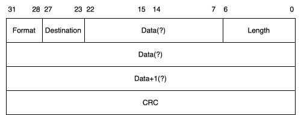
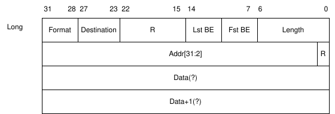
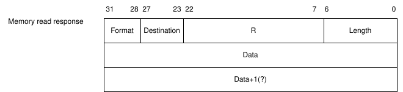
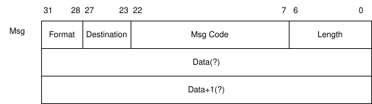
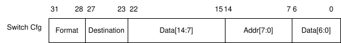
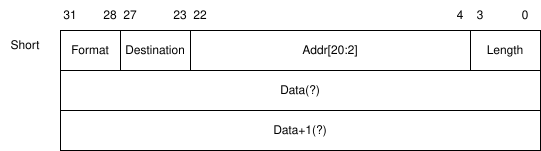
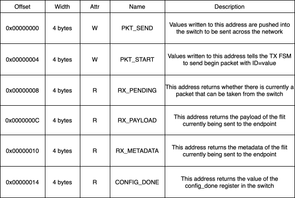

# Protocol Layer

## Protocol Packets

Packets are defined as arrays of 32-bit words with a self-consistent length and
format depending on the first word in the array. They can be used to access an
endpoint memory map, configure switches across the network, or to send general
messages between nodes in the network.

Note that the endpoint's memory map may not necessarily be the same as memory
map of the tile. For example, if a compute chiplet attaches the endpoint to its
internal AHB bus, there are no requirements that the memory map of the AHB bus
match the memory map of the endpoint. This allows backwards compatible upgrades
to tiles since memory maps can be consistent across generations.

An endpoint's memory map may also be considered application-defined for all
applications on non-specialized chiplets. For example, when connecting two
compute chiplets together, the shared application defines the assumed memory
map between the devices. If the application requires pseudo-shared memory, it
would be valid to interpret address fields to be absolute or relative address.
If the application requires no specific memory map, it would also be valid to
ignore the address field.

The general format of packets is shown below. The 7 bit length is reduced to
4 bits in the short formats. Any words after the header are dependent on the
type and length given in the header. There is no error detection integrated
into the protocol layer; it is handled by the data link layer. For memory
read/write packets, a length of 0 is translated to transfer the maximum number
of words for that packet type. This ensures that it is impossible to request no
bytes be transferred across the network.

The 32-bit header word contains a 4-bit Format field (bits 31–28), a 5-bit Destination field (bits 27–23), a 7-bit Length field (bits 22–15, reduced to 4 bits in short formats), and a CRC in the lower bits. Any words following the header depend on the format and length values.

### Packet formats

A general overview of each packet format is described in the table below.

| Format               |  Value  |  Description                                                                         |
| :------------------- | :-----: | :----------------------------------------------------------------------------------- |
| Long memory read     |   0x0   | Used to read up to 128 contiguous words from the endpoint's memory map.              |
| Long memory write    |   0x1   | Used to write up to 128 contiguous words to the endpoint's memory map.               |
| Memory read response |   0x2   | Used to send responses to memory read requests.                                      |
| Message              |   0x3   | Used to send general messages to other nodes. Can contain data up to 127 bytes long. |
| Switch configuration |   0x4   | Used to send configuration data to a switches register bank.                         |
| Short memory read    |   0x8   | Used to read up to 16 contiguous words from the endpoint's memory map.               |
| Short memory write   |   0x9   | Used to write up to 16 contiguous words from the endpoint's memory map.              |

#### Long Memory Read/Write Packet

The layout of the long memory read/write packet is shown below. It supports up
to 128 words of data transfered in a single transaction. For read packets, the
length describes the length of the memory read response NOT the length of the
request packet. The `R` fields are reserved and assumed to be all 0's. The `Lst
BE`/`Fst BE` fields are byte enable descriptors for the first and last words of
the memory transaction. For example a write packet with `Lst BE = 0x7` would
only write the lower 3 bytes of the final word. The `Addr` field is assumed to
be word aligned and reserves the lower bits as 0's.

The first word contains a 4-bit Format, 5-bit Destination, 7-bit Length, Lst BE and Fst BE byte-enable fields, and reserved bits. The second word carries the 30-bit word-aligned address (Addr[31:2]). Subsequent words carry the data payload up to 128 words.

#### Memory Read Response Packet

The layout of the memory read response packet is shown below. It supports data
payloads of up to 128 words.

#### Message Packet

The message packet is used for general message passing across the network. Each
packet contains a 16 bit message code. There are 4 predefined message codes
described in the table below. Each endpoint is not required to respond to any
particular set of message codes. Endpoints are free to define their
interpretation of undefined message codes. Message packets with `Length = 0`
have no following data words.

The first word carries the Format, Destination, and Length fields. The second word contains a 16-bit message code in the lower half. Any following words are the data payload; if Length = 0, no data words follow.

#### An example mapping of message codes

| Message Code       |  Value  |
| :------------------| :-----: |
| Interrupt Assert   |   0x0   |
| Interrupt Deassert |   0x1   |
| Completion         |   0x2   |
| Retryable Failure  |   0x3   |
| Undefined          |   ...   |

#### Switch Configuration Packet

The switch configuration packet is used for initializing the configurable
aspects of each switch such as routing tables, datelines, and node IDs. The
switch configuration packet is special in that it is only a single word. No
response packets are sent following initialization. The switch configuration
space consists of a 256 15-bit entries. The switch configuration address space
is described in more depth in [switch configuration space](data_link_layer.md).

#### Short Memory Read/Write Packet

The layout of the short memory read/write packet is shown below. It supports up
to 16 words of data transfered in a single transaction. For read packets, the
length describes the length of the memory read response NOT the length of the
request packet. The `Addr` field is a word-aligned, 21-bit offset from the
endpoint base address register, giving up to 2MB of address space.

The header word contains a 4-bit Format, 5-bit Destination, 4-bit Length, and a 19-bit word-aligned address offset (Addr[20:2]). Subsequent words carry the data payload up to 16 words.

### Endpoint

From the processor side of the network, all network communication occurs
through the endpoint which manages network state and buffers for packets.
The endpoint is a small wrapper around an FSM which attaches a CRC flit to the
end of applicable packets and manages the flow of flits into the switch. This
FSM must be activated before any data is sent into the endpoint. The endpoint
has interrupt lines that can be used to interrupt the processor on the
reception of a packet.

The memory map of the endpoint is shown below. The caches are mapped directly
in the address space of the endpoint. The bus-facing memory map of the endpoint
does not correlate at all to the network-facing endpoint memory map.

