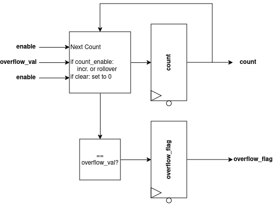
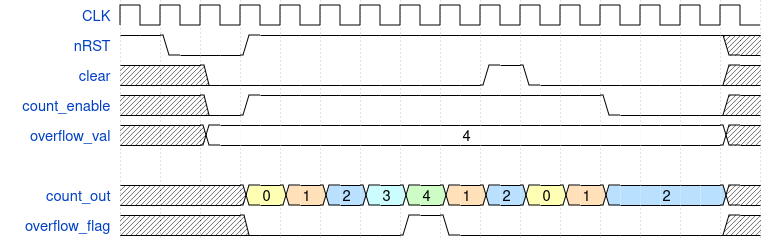

# Counter
A simple binary up-counter.

### RTL Diagram

### Sample Waveform

## I/O
| Port Name | Direction | Type | Description |
|:---------:|:---------:|:----:|:-----------|
| `CLK` | `input` | `logic` | Clock |
| `nRST` | `input` | `logic` | Active-low asynchronous reset |
| `clear` | `input` | `logic` | Synchronous reset of count value |
| `count_enable` | `input` | `logic` | Enables counting in the current cycle |
| `overflow_val` | `input` | `logic [NBITS-1 : 0]` | Compare value for setting `overflow_flag` |
| `count_out` | `output` | `logic [NBITS-1 : 0]` | Current counter value |
| `overflow_flag` | `output` | `logic` | Indicates that the count hit the `overflow_val` |

## Function
When `count_enable` is high, the counter will increment by 1 each cycle until `count` == `overflow_val`; counting past `overflow_val` will cause the counter to roll over to **1**. Setting the `clear` input will synchronously reset the counter to zero. Note that `clear` takes effect regardless of the state of `count_enable`

The `overflow_flag` is set when `count` == `overflow_val`, and cleared when the count rolls over. `overflow_flag` is driven from a register.

On reset, `count` and `overflow_flag` are 0. 

## Parameters
| Parameter     | Type | Description | Default Value | Valid Range |
|:---------------:|:------:|:-------------|:---------------:|:-------------:|
| `NBITS` | `int` | Number of bits to use in the counter | 4 | >= 1 |
