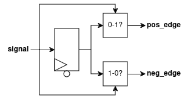
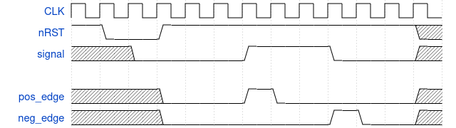

# Edge Detector
Detects 0-1 or 1-0 transitions in an input signal between two cycles, *combinationally*.

### RTL Diagram

### Sample Waveform

## I/O
| Port Name | Direction | Type | Description |
|:---------:|:---------:|:----:|:-----------|
| `CLK` | `input` | `logic` | Clock |
| `nRST` | `input` | `logic` | Active-low asynchronous reset |
| `signal` | `input` | `logic [WIDTH-1 : 0]` | Input signal to monitor for transitions |
| `pos_edge` | `output` | `logic [WIDTH-1 : 0]` | High if a 0-1 transition detected on the corresponding input signal |
| `neg_edge` | `output` | `logic [WIDTH-1 : 0]` | High if a 1-0 transition detected on the corresponding input signal |

## Function
This module detects transitions in the input signal(s) by latching their value in a DFF each cycle. The current input is compared
to the latched value; if they are not the same, either the corresponding `pos_edge` or `neg_edge` value is set. Note that due to the way this is computed, the edge detection is ready within the same cycle it occurs, but is *not* driven from a register (this is a *Mealy machine*)!

## Parameters
| Parameter     | Type | Description | Default Value | Valid Range |
|:---------------:|:------:|:-------------|:---------------:|:-------------:|
| `WIDTH` | `int` | Bit-width of the input signal to monitor | 1 | >= 1 |