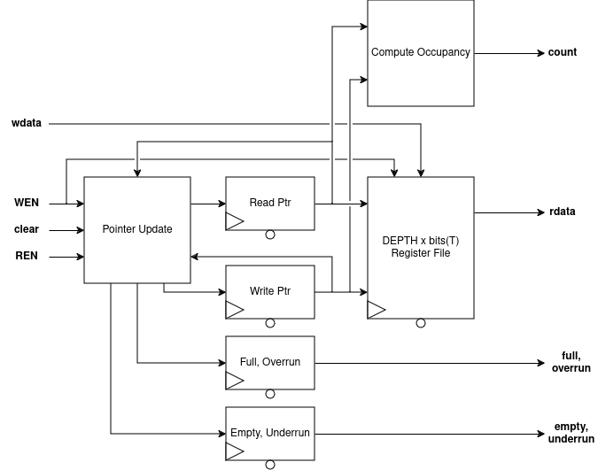

# FIFO
DFF-based FIFO queue for single clock domains.

### RTL Diagram

## I/O
| Port Name | Direction | Type | Description |
|:---------:|:---------:|:----:|:-----------|
| `CLK` | `input` | `logic` | Clock |
| `nRST` | `input` | `logic` | Active-low asynchronous reset |
| `wdata` | `input` | `T` | Data to be written to tail of FIFO |
| `full` | `output` | `logic` | Flag indicating FIFO is full |
| `empty` | `output` | `logic` | Flag indicating FIFO is empty |
| `underrun` | `output` | `logic` | Error flag raised by reading an empty FIFO |
| `overrun` | `output` | `logic` | Error flag raised by writing a full FIFO |
| `count` | `output` | `logic [$clog2(DEPTH)-1 : 0]` | Current occupancy of FIFO |
| `rdata` | `output` | `T` | Head element of FIFO |

## Function
This is a simple FIFO (First-In, First-Out) queue made from DFFs. This is *not* suitable for clock domain crossing applications. 

The `WEN` and `REN` signals control writing and reading to the FIFO, respectively. When the FIFO is full/empty, the `full`/`empty` signal will be asserted. These signals are available the same cycle the FIFO becomes full. Attempting to write/read a full/empty FIFO will cause the `overrun`/`underrun` flag to be raised; this is also stored in a register. *The overrun/underrun flags sticky; they are only cleared by `clear`-ing the FIFO*. To reduce critical paths, internal forwarding is not performed. This means that if the FIFO is `full`/`empty` and `WEN` and `REN` are raised, then the `overrun`/`underrun` flags will be raised.

`wdata` is the data to be written to the FIFO if the `WEN` signal is high. `rdata` is the current head of the FIFO queue, but is only valid if `empty` is not set. Additionally, as the value is only dequeued from the FIFO when `REN` is set, a "peek" operation can be done by simply using `rdata` without asserting `REN`. The `count` output gives the occupancy of the FIFO, to be used with rate-limiting or watermarking.

If an overrun/underrun condition is encountered, the behavior of the FIFO is to *not* modify the contents or pointers of the FIFO, and *only* set the corresponding flag; this makes it suitable for applications where elements may be "dropped" if the incoming rate is too high. Typical use cases should regard the FIFO's contents as invalid if one of the error flags is set, and data regenerated.

The `clear` signal provides a way to synchronously reset the FIFO (e.g. "empty" the FIFO). The `clear` signal takes priority over any other control signal. The intended use is for cases where an error condition is encountered and the data should be retried.

On reset, the read/write pointers are set to an equal value to indicate an empty FIFO, and the `full`, `overrun` and `underrun` values are set to 0 with `empty` set to 1.

## Parameters
| Parameter     | Type | Description | Default Value | Valid Range |
|:---------------:|:------:|:-------------|:---------------:|:-------------:|
| `T` | `type` | Data type held in the FIFO | `logic [7:0]` | Any SystemVerilog type |
| `DEPTH` | `int` | Number of entries in the FIFO | 8 | Any power of 2 >= 1 |
