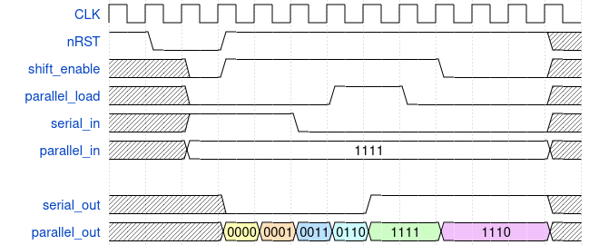

# Shift Register
Simple shift register with serial-to-parallel and parallel-to-serial functionality.

### Sample Waveform

## I/O
| Port Name | Direction | Type | Description |
|:---------:|:---------:|:----:|:-----------|
| `CLK` | `input` | `logic` | Clock |
| `nRST` | `input` | `logic` | Active-low asynchronous reset |
| `shift_enable` | `input` | `logic` | Enable shifting in direction of `SHIFT_MSB` parameter |
| `serial_in` | `input` | `logic` | Serial input |
| `parallel_load` | `input` | `logic` | Loads parallel data into shift register |
| `parallel_in` | `input` | `logic [NBITS-1 : 0]` | Parallel input data |
| `serial_out` | `output` | `logic` | Serial out |
| `parallel_out` | `output` | `logic [NBITS-1 : 0]` | Parallel value of shift register |

## Function
This implements a shift register capable of serial-to-parallel and parallel-to-serial conversion in addition to simple shifting. When the `shfit_enable` signal is high, the shift register will shift by 1 position each cycle in the direction indicated by `SHIFT_MSB`. 

If `parallel_load` is high, the value of `parallel_in` is loaded into the shift register. This overrides `shift_enable`, and the register will *not* shift during this cycle.

The shift register will reset to the value indicated by `RESET_VAL`. 

## Parameters
| Parameter     | Type | Description | Default Value | Valid Range |
|:---------------:|:------:|:-------------|:---------------:|:-------------:|
| `NUM_BITS` | `int` | Number of bits in the shift register | 4 | >= 2 |
| `SHIFT_MSB` | `bit` | Determines shifting direction. `SHIFT_MSB = 1` indicates that the value shifts in/out MSB-first, `SHIFT_MSB = 0` indicates LSB first. | 1 (MSB) | 0 (LSB), 1 (MSB) |
| `RESET_VAL` | `bit` | Value to set all bits of shift register to on reset | `1'b1` | 0, 1|