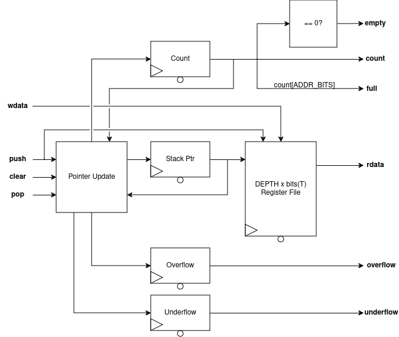

# Stack
DFF-based LIFO stack queue.

### RTL Diagram

## I/O
| Port Name | Direction | Type | Description |
|:---------:|:---------:|:----:|:-----------|
| `CLK` | `input` | `logic` | Clock |
| `nRST` | `input` | `logic` | Active-low asynchronous reset |
| `wdata` | `input` | `T` | Data to be pushed onto stack |
| `full` | `output` | `logic` | Flag indicating stack is full |
| `empty` | `output` | `logic` | Flag indicating stack is empty |
| `underflow` | `output` | `logic` | Error flag raised by reading an empty stack |
| `overflow` | `output` | `logic` | Error flag raised by writing a full stack |
| `count` | `output` | `logic [$clog2(DEPTH)-1 : 0]` | Current occupancy of stack |
| `rdata` | `output` | `T` | Top element of stack |

## Function
This is a simple LIFO (Last-In, First-Out) queue made from DFFs.

The `push` and `pop` signals control writing and reading to the stack, respectively. When the stack is full (empty), the `full` (`empty`) signal will be asserted. These values are available the same cycle the stack becomes full, but are not driven directly from registers. Attempting to push (pop) a full (empty) stack will cause the `overflow` (`underflow`) flag to be raised; this is driven from a register. *The `overflow` and `underflow` flags will only appear for a single cycle after the attempt to push (pop) the full (empty) stack*.  

`wdata` is the data to be pushed to the stack if the `WEN` signal is high. `rdata` is the current top of the stack, but is only valid if `empty` is not set. Additionally, as the value is only dequeued from the stack when `pop` is set, a "peek" operation can be done by simply using `rdata` without asserting `pop`. The `count` output gives the occupancy of the stack, to be used with rate-limiting or watermarking, and is driven directly from a register.

If an overrun/underrun condition is encountered, the behavior of the stack is *to modify the contents and pointer of the stack*; this makes it suitable for applications where elements may be "dropped" from the *bottom* of the stack if the incoming rate is too high (that is, the stack will contain the last `DEPTH` elements pushed to it, as would be desirable for a Return Address Stack). Typical use cases should regard the stack's contents as invalid if one of the error flags is set, and data regenerated.

The `clear` signal provides a way to synchronously reset the stack (e.g. "empty" the stack). The `clear` signal takes priority over any other control signal. The intended use is for cases where an error condition is encountered and the data should be retried.

On reset, the stack pointer is set to zero to indicate an empty stack, and the `full`, `empty`, `count`, `overflow` and `underflow` values are set to 0. 

## Parameters
| Parameter     | Type | Description | Default Value | Valid Range |
|:---------------:|:------:|:-------------|:---------------:|:-------------:|
| `T` | `type` | Data type held in the stack | `logic [7:0]` | Any SystemVerilog type |
| `DEPTH` | `int` | Number of entries in the stack | 8 | Any power of 2 >= 1 |