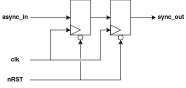

# Synchronizer
This is an implementation of a simple, single-bit synchronizer, useful for synchronizing single-bit inputs from off-chip or between clock domains.

### RTL Diagram

## I/O
| Port Name | Direction | Type | Description |
|:---------:|:---------:|:----:|:-----------|
| `CLK` | `input` | `logic` | Clock |
| `nRST` | `input` | `logic` | Active-low asynchronous reset |
| `async_in` | `input` | `logic` | Single-bit input to synchronize |
| `sync_out` | `output` | `logic` | Single-bit synchronized output signal |

## Function
Synchronizes a single-bit input signal into a clock domain using a chain of DFFs. On reset, each of the DFFs is set to `RESET_STATE`.

## Parameters
| Parameter     | Type | Description | Default Value | Valid Range |
|:---------------:|:------:|:-------------|:---------------:|:-------------:|
| `RESET_STATE` | `bit` | Initial value of the synchronizer flip-flops on reset | `1'b1` | `1'b0`, `1'b1` |
| `STAGES` | `int` | Number of flip-flops in the synchronizer | 2 | 2-3 |

